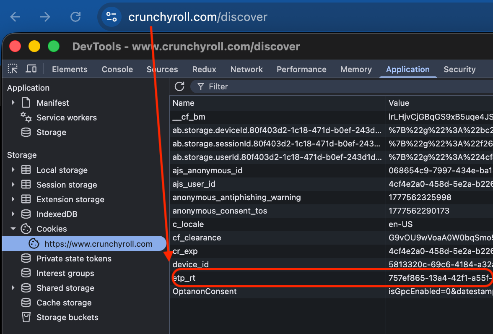

# Crunchyroll Downloader

> CLI tool that downloads anime from Crunchyroll with Widevine DRM decryption, outputting MKV files with metadata, selectable audio dubs, and subtitles.

Built in Go. No browser automation, no yt-dlp — fetches DASH manifests directly via authenticated Crunchyroll APIs, decrypts with Widevine CDM keys, and muxes with FFmpeg.

---

## Features

- Download single episodes or entire seasons/series
- Choose audio language (dub) and subtitle language per download
- Configurable video quality (1080p, 720p, etc.) and audio quality (192k, 128k, etc.)
- Widevine DRM decryption (`.wvd` file or `client_id.bin` + `private_key.pem`)
- MKV output with embedded metadata (show title, season, episode number, episode name)
- Parallel segment downloads (10 workers) for faster throughput
- Retry with exponential backoff on connection errors
- Batch download from a text file of URLs
- Automatic access token refresh on 401 responses
- Skips already-downloaded episodes

---

## Tech Stack

| Layer            | Technology                                     |
| ---------------- | ---------------------------------------------- |
| Language         | Go 1.25                                        |
| DRM              | gowidevine (Widevine CDM + PSSH extraction)    |
| Manifest Parsing | go-mpd (DASH MPD)                              |
| Muxing           | FFmpeg (external, must be installed)            |
| Auth             | Crunchyroll `etp_rt` cookie → Bearer token     |
| Output           | MKV container with metadata                    |

---

## Project Structure

```
crunchyroll-downloader/
├── .github/
│   └── workflows/
│       └── build.yml      # CI: cross-platform build + GitHub Release
├── assets/                # Default location for .wvd / client_id.bin / private_key.pem
├── bin/                   # Local build output (gitignored)
├── main.go                # CLI flags, URL routing, audio language GUID resolution
├── download.go            # Episode + season download orchestration, segment fetching
├── episode.go             # Playback API, episode metadata, stream teardown
├── season.go              # Season list + episode list from CMS API
├── mpd.go                 # DASH manifest parsing, video/audio representation selection
├── drm.go                 # Widevine PSSH extraction, license request, key decryption
├── output.go              # FFmpeg mux (video + audio + subtitles → MKV)
├── token.go               # OAuth token from etp_rt cookie
├── http_request.go        # Shared HTTP client with 401 retry + token refresh
├── utils.go               # Language display name mapping
├── go.mod
├── CHANGELOG.md
└── README.md
```

---

## Requirements

- [Go](https://go.dev/dl/) (for building from source)
- [FFmpeg](https://www.ffmpeg.org/download.html#get-packages) (must be in PATH)
- A Crunchyroll account (Premium required for Premium-only content)
- A Widevine CDM — either a `.wvd` file, or a `client_id.bin` + `private_key.pem` pair

---

## Getting Started

### Installation

Download the latest binary from the [releases page](https://github.com/MantisWare/crunchyroll-downloader/releases/latest) for your platform, or build from source:

```bash
git clone https://github.com/MantisWare/crunchyroll-downloader.git
cd crunchyroll-downloader
go build -ldflags="-s -w" -o bin/crunchyroll-downloader .
```

The binary is output to `bin/`. The `-s -w` flags strip debug symbols for a smaller binary.

### Get Your `etp_rt` Cookie

1. Go to [crunchyroll.com](https://crunchyroll.com) and log in
2. Open Developer Tools
   - **Firefox:** Storage → Cookies
   - **Chrome:** Application → Cookies
3. Select the Crunchyroll domain and copy the `etp_rt` cookie value



### Get a Widevine CDM

Crunchyroll uses DRM-protected content. You need a `.wvd` file (or `client_id.bin` + `private_key.pem`) to obtain decryption keys. If you don't have a rooted Android device, search "ready to use cdms" — there are plenty of sources.

Place your CDM files in any of these locations (checked in order):

1. Current working directory (`.`)
2. `assets/` relative to the working directory
3. `assets/` relative to the binary location

---

## Usage

```
Usage of ./crunchyroll-downloader:
  -audio-lang string
        Audio language (default "ja-JP")
  -audio-quality string
        Audio quality (default "192k")
  -etp-rt string
        The "etp_rt" cookie value of your account
  -season int
        Season number. Not used if an episode link is entered
  -subs-lang string
        Subtitles language (default "en-US")
  -url string
        URL of the episode/season to download
  -urls string
        Path to a text file with one URL per line
  -video-quality string
        Video quality (default "1080p")
```

### Download a Season (English Dub)

```bash
./crunchyroll-downloader \
  --url https://www.crunchyroll.com/series/GJ0H7Q5ZJ/hells-paradise \
  --season 1 \
  --audio-lang en-US \
  --etp-rt your_token_here
```

### Download a Single Episode (Japanese Audio + English Subs)

```bash
./crunchyroll-downloader \
  --url https://www.crunchyroll.com/watch/GE00198973JAJP/dawn-and-confusion \
  --audio-lang ja-JP \
  --subs-lang en-US \
  --etp-rt your_token_here
```

### Batch Download from a File

```bash
./crunchyroll-downloader \
  --urls list.txt \
  --audio-lang pt-BR \
  --subs-lang pt-BR \
  --etp-rt your_token_here
```

The text file should contain one URL per line. Invalid URLs are skipped.

---

## Supported Languages

Audio and subtitle languages use BCP 47 locale codes. Available options depend on what Crunchyroll provides per title.

| Code      | Language                |
| --------- | ----------------------- |
| `ja-JP`   | Japanese                |
| `en-US`   | English                 |
| `en-IN`   | English (India)         |
| `es-419`  | Español (Latin America) |
| `es-ES`   | Español (Spain)         |
| `pt-BR`   | Português (Brazil)      |
| `pt-PT`   | Português (Portugal)    |
| `fr-FR`   | Français                |
| `de-DE`   | Deutsch                 |
| `it-IT`   | Italiano                |
| `ru-RU`   | Русский                 |
| `ar-SA`   | العربية                 |
| `hi-IN`   | हिंदी                   |
| `ko-KR`   | 한국어                  |
| `zh-CN`   | 中文 (Mandarin)         |
| `zh-TW`   | 中文 (Taiwanese)        |
| `id-ID`   | Bahasa Indonesia        |
| `ms-MY`   | Bahasa Melayu           |
| `th-TH`   | ไทย                     |
| `vi-VN`   | Tiếng Việt              |
| `tr-TR`   | Türkçe                  |
| `pl-PL`   | Polski                  |
| `ca-ES`   | Català                  |
| `ta-IN`   | தமிழ்                   |
| `te-IN`   | తెలుగు                  |
| `zh-HK`   | 中文 (Cantonese)        |

---

## How It Works

1. **Authenticate** — exchanges the `etp_rt` cookie for a Bearer access token (auto-refreshes on expiry)
2. **Resolve content** — fetches episode metadata from the CMS API; for season URLs, lists all episodes in the season
3. **Select audio dub** — if the requested `-audio-lang` differs from the episode's default, looks up the correct version GUID from the available dubs and switches to it
4. **Fetch playback** — calls the playback API with the resolved GUID to get the DASH manifest, subtitle URLs, and Widevine token
5. **Parse manifest** — extracts video and audio adaptation sets from the MPD, selects representations matching the requested quality
6. **Obtain keys** — extracts PSSH from the manifest, sends a Widevine license request, and retrieves content decryption keys
7. **Download segments** — fetches all DASH segments in parallel (10 workers) with retry + backoff
8. **Decrypt** — decrypts the MP4 segments using the Widevine keys
9. **Download subtitles** — fetches the `.ass` subtitle file for the requested language (if available)
10. **Mux** — runs FFmpeg to combine video + audio + subtitles into a single MKV with embedded metadata
11. **Cleanup** — removes temporary segment and subtitle files, notifies Crunchyroll the stream has ended

---

## CI/CD

GitHub Actions handles cross-platform builds and releases automatically.

### Build Matrix

Every push to `main` and every pull request builds binaries for all supported platforms:

| Platform       | Architecture | Binary Name                               |
| -------------- | ------------ | ----------------------------------------- |
| Linux          | amd64        | `crunchyroll-downloader-linux-amd64`      |
| Linux          | arm64        | `crunchyroll-downloader-linux-arm64`      |
| macOS          | amd64        | `crunchyroll-downloader-darwin-amd64`     |
| macOS          | arm64        | `crunchyroll-downloader-darwin-arm64`     |
| Windows        | amd64        | `crunchyroll-downloader-windows-amd64.exe`|

All builds use `CGO_ENABLED=0` for fully static binaries with no external C dependencies.

### Creating a Release

Tag a commit and push the tag — the workflow builds all platforms, generates a SHA-256 checksum file, and creates a GitHub Release with auto-generated release notes:

```bash
git tag v1.3.0
git push origin v1.3.0
```

The release will appear at `https://github.com/MantisWare/crunchyroll-downloader/releases/tag/v1.3.0` with all binaries and `checksums.txt` attached.

### Build Locally

```bash
# Default: build for current OS/arch → bin/
go build -ldflags="-s -w" -o bin/crunchyroll-downloader .

# Cross-compile for Linux arm64
GOOS=linux GOARCH=arm64 CGO_ENABLED=0 go build -ldflags="-s -w" -o bin/crunchyroll-downloader-linux-arm64 .
```

---

## License

[Add your license here]

---

*Forked and maintained by Mantisware.*
