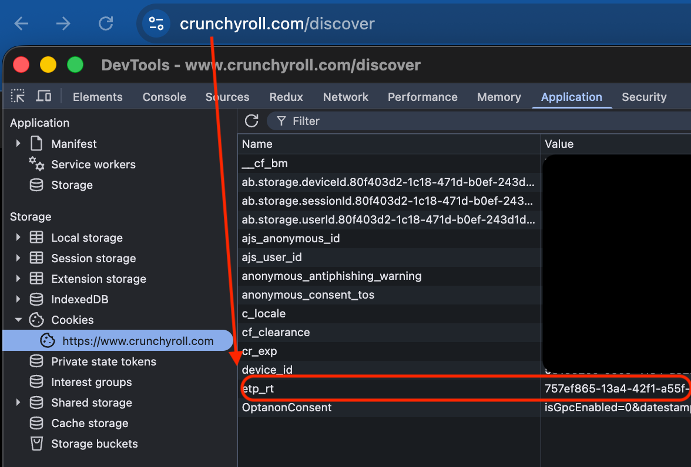

# Crunchyroll Downloader

> CLI and desktop UI that download anime from Crunchyroll with Widevine DRM decryption, outputting MKV files with metadata, selectable audio dubs, and subtitles.

Built in Go. A temporary browser is used only for optional account sign-in; downloads fetch DASH manifests directly through authenticated Crunchyroll APIs, decrypt with Widevine CDM keys, and mux with FFmpeg.

---

## Features

- Download single episodes or entire seasons/series
- CLI and a simple cross-platform desktop UI (macOS, Linux, Windows)
- One-click Crunchyroll sign-in through an isolated Chrome, Edge, Brave, or Chromium window
- Paste a Crunchyroll URL in the UI to list episodes (or a single episode) and pick download options
- Convert a local video file, multiple dropped files, or a full folder to a selected video/audio quality
- Choose audio language (dub) and subtitle language per download
- Configurable video quality (1080p, 720p, etc.) and audio quality (192k, 128k, etc.)
- Widevine DRM decryption (`.wvd` file or `client_id.bin` + `private_key.pem`)
- MKV output with embedded metadata and filenames that include the Crunchyroll episode title (`Show S01E02 Episode Title [1080p].mkv`)
- Parallel segment downloads (10 workers) for faster throughput
- Retry with exponential backoff on connection errors
- Batch download from a text file of URLs
- Automatic access token refresh before expiry, with bounded retries on 401 responses
- Skips already-downloaded episodes (re-running a season scans the series folder and only fetches missing or incomplete files)
- After a season pass, retries missing or incomplete episodes

---

## Tech Stack

| Layer            | Technology                                     |
| ---------------- | ---------------------------------------------- |
| Language         | Go 1.25                                        |
| Desktop UI       | Fyne v2 (OpenGL / native windowing)            |
| DRM              | gowidevine (Widevine CDM + PSSH extraction)    |
| Manifest Parsing | go-mpd (DASH MPD)                              |
| Muxing           | FFmpeg (external, must be installed)            |
| Auth             | Managed browser sign-in or `etp_rt` cookie     |
| Output           | MKV container with metadata                    |

---

## Project Structure

```
crunchyroll-downloader/
├── .github/
│   └── workflows/
│       └── build.yml      # CI: cross-platform build + GitHub Release
├── assets/                # Default location for .wvd / client_id.bin / private_key.pem
├── bin/                   # Local build output (gitignored)
├── main.go                # CLI flags, URL routing, audio language GUID resolution
├── gui.go                 # Desktop UI (built with -tags gui)
├── gui_actions.go         # UI fetch / download wiring
├── gui_browser_login.go   # UI sign-in state, cancellation, and feedback
├── gui_theme.go           # Dark Crunchyroll-style Fyne theme
├── gui_log.go             # Download progress log in the UI
├── gui_progress.go        # Download progress bar tracking
├── gui_convert.go         # Convert tab, file/folder picker, and drag-and-drop
├── catalog.go             # Available audio/subtitle/quality lookup per title
├── converter.go           # Cancellable FFmpeg video conversion
├── flags.go               # Shared CLI/GUI option defaults
├── url.go                 # Crunchyroll URL parsing
├── resolve.go             # Episode/season GUID resolution for the requested dub
├── config.go              # Saved settings in ~/.crunchyroll.config/config.json
├── cancel.go              # Cancellation context for stopping a download run
├── download.go            # Episode + season download orchestration, segment fetching
├── episode.go             # Playback API, episode metadata, stream teardown
├── season.go              # Season list + episode list from CMS API
├── mpd.go                 # DASH manifest parsing, video/audio representation selection
├── drm.go                 # Widevine PSSH extraction, license request, key decryption
├── output.go              # FFmpeg mux (video + audio + subtitles → MKV)
├── token.go               # OAuth token from etp_rt cookie, expiry tracking
├── browser_login.go       # Managed Chromium login and cookie extraction
├── http_request.go        # Pooled HTTP clients, bounded 401 retry + token refresh
├── utils.go               # Language display name mapping
├── go.mod
├── build.sh               # Build the CLI binary into bin/
├── build_UI.sh            # Build the desktop UI binary into bin/
├── release.sh             # Tag + push release helper script
├── CHANGELOG.md
└── README.md
```

---

## Requirements

- [Go](https://go.dev/dl/) (for building from source)
- A C compiler for the **desktop UI** (Xcode Command Line Tools on macOS, `gcc`/`libgl` on Linux, MinGW on Windows)
- [FFmpeg](https://www.ffmpeg.org/download.html#get-packages) (must be in PATH)
- A Crunchyroll account (Premium required for Premium-only content)
- Chrome, Edge, Brave, or Chromium for automatic browser sign-in (manual cookie entry remains available)
- A Widevine CDM — either a `.wvd` file, or a `client_id.bin` + `private_key.pem` pair

---

## Getting Started

### Installation

Download the latest binary from the [releases page](https://github.com/MantisWare/crunchyroll-downloader/releases/latest) for your platform, or build from source:

```bash
git clone https://github.com/MantisWare/crunchyroll-downloader.git
cd crunchyroll-downloader
./build.sh
```

The CLI binary is output to `bin/crunchyroll-downloader`.

### Desktop UI

```bash
./build_UI.sh
./bin/crunchyroll-downloader-gui
```

The desktop app has two tabs:

#### Download

1. Click **Sign in with browser** and complete the Crunchyroll login in the temporary browser window
2. The app captures the session cookie automatically and removes the temporary browser profile
3. Paste a Crunchyroll **series** or **watch** URL and click **Lookup**
4. The UI reveals the audio/dub, subtitle, quality, and season options available for that title
5. Series URLs show a season picker and episode checklist; episode URLs show that one episode
6. Select episodes and click **Download selected** — a progress bar at the bottom tracks the run
7. Click **Stop** to interrupt a download in progress; partial files are cleaned up
8. Click **Reset** to clear the URL, episode list, and log so you can paste another link

#### Convert

1. Open the **Convert** tab.
2. Drop one or more video files—or a folder—onto the tab. You can also use **Choose file** or **Choose folder**.
3. Select the target video and audio quality.
4. Click **Convert**. FFmpeg creates H.264/AAC MP4 files named like `Show S01E02 Episode Title [720p].mp4`.
5. A folder conversion writes its files into a `converted_720p/` folder inside the selected folder.
6. Click **Stop** to cancel the current FFmpeg process and the remaining queue.

Supported inputs are MP4, MKV, MOV, AVI, WebM, M4V, FLV, and WMV. Folder conversion processes supported files directly inside the selected folder.

Settings are stored in `~/.crunchyroll.config/config.json` (created on first launch). That file keeps your `etp_rt` cookie, audio/subtitle languages, video and audio quality, and download folder. The CLI also reads `etp_rt` from there if you omit `-etp-rt`.

The `-s -w` flags strip debug symbols for a smaller CLI binary if you build by hand:

```bash
go build -ldflags="-s -w" -o bin/crunchyroll-downloader .
```

### Sign In to Crunchyroll

In the desktop UI, click **Sign in with browser**. For the CLI, add `-browser-login`:

```bash
./bin/crunchyroll-downloader -browser-login
```

This can be run by itself to save the login, or together with `-url`/`-urls` to continue directly into a download. The app launches a supported Chromium-based browser with an isolated temporary profile. Enter your credentials directly on Crunchyroll; the downloader never receives your password, 2FA code, or CAPTCHA response. Once Crunchyroll issues the `etp_rt` session cookie, the app saves it in `~/.crunchyroll.config/config.json`, closes the temporary session, and removes its profile.

Browser sign-in times out after 10 minutes and can be cancelled from the desktop UI or with Ctrl+C in the CLI.

#### Manual cookie fallback

1. Go to [crunchyroll.com](https://crunchyroll.com) and log in
2. Open Developer Tools
   - **Firefox:** Storage → Cookies
   - **Chrome:** Application → Cookies
3. Select the Crunchyroll domain and copy the `etp_rt` cookie value



### Get a Widevine CDM

Crunchyroll uses DRM-protected content. You need a `.wvd` file (or `client_id.bin` + `private_key.pem`) to obtain decryption keys. If you don't have a rooted Android device, search "ready to use cdms" — there are plenty of sources.

Place your CDM files in any of these locations (checked in order):

1. Current working directory (`.`)
2. `assets/` relative to the working directory
3. `assets/` relative to the binary location

---

## Usage

```
Usage of ./crunchyroll-downloader:
  -audio-lang string
        Audio language (default "ja-JP")
  -audio-quality string
        Audio quality (default "192k")
  -browser-login
        Open a browser to sign in and capture the etp_rt cookie
  -etp-rt string
        The "etp_rt" cookie value of your account
  -season int
        Season number. Not used if an episode link is entered
  -subs-lang string
        Subtitles language (default "en-US")
  -url string
        URL of the episode/season to download
  -urls string
        Path to a text file with one URL per line
  -video-quality string
        Video quality (default "1080p")
```

### Download a Season (English Dub)

```bash
./crunchyroll-downloader \
  --url https://www.crunchyroll.com/series/GJ0H7Q5ZJ/hells-paradise \
  --season 1 \
  --audio-lang en-US \
  --etp-rt your_token_here
```

### Download a Single Episode (Japanese Audio + English Subs)

```bash
./crunchyroll-downloader \
  --url https://www.crunchyroll.com/watch/GE00198973JAJP/dawn-and-confusion \
  --audio-lang ja-JP \
  --subs-lang en-US \
  --etp-rt your_token_here
```

### Batch Download from a File

```bash
./crunchyroll-downloader \
  --urls list.txt \
  --audio-lang pt-BR \
  --subs-lang pt-BR \
  --etp-rt your_token_here
```

The text file should contain one URL per line. Invalid URLs are skipped.

---

## Supported Languages

Audio and subtitle languages use BCP 47 locale codes. Available options depend on what Crunchyroll provides per title.

| Code      | Language                |
| --------- | ----------------------- |
| `ja-JP`   | Japanese                |
| `en-US`   | English                 |
| `en-IN`   | English (India)         |
| `es-419`  | Español (Latin America) |
| `es-ES`   | Español (Spain)         |
| `pt-BR`   | Português (Brazil)      |
| `pt-PT`   | Português (Portugal)    |
| `fr-FR`   | Français                |
| `de-DE`   | Deutsch                 |
| `it-IT`   | Italiano                |
| `ru-RU`   | Русский                 |
| `ar-SA`   | العربية                 |
| `hi-IN`   | हिंदी                   |
| `ko-KR`   | 한국어                  |
| `zh-CN`   | 中文 (Mandarin)         |
| `zh-TW`   | 中文 (Taiwanese)        |
| `id-ID`   | Bahasa Indonesia        |
| `ms-MY`   | Bahasa Melayu           |
| `th-TH`   | ไทย                     |
| `vi-VN`   | Tiếng Việt              |
| `tr-TR`   | Türkçe                  |
| `pl-PL`   | Polski                  |
| `ca-ES`   | Català                  |
| `ta-IN`   | தமிழ்                   |
| `te-IN`   | తెలుగు                  |
| `zh-HK`   | 中文 (Cantonese)        |

---

## How It Works

1. **Authenticate** — optionally captures `etp_rt` through an isolated browser login, then exchanges it for a Bearer access token (auto-refreshes on expiry)
2. **Resolve content** — fetches episode metadata from the CMS API; for season URLs, lists all episodes in the season
3. **Select audio dub** — if the requested `-audio-lang` differs from the episode's default, looks up the correct version GUID from the available dubs and switches to it
4. **Fetch playback** — calls the playback API with the resolved GUID to get the DASH manifest, subtitle URLs, and Widevine token
5. **Parse manifest** — extracts video and audio adaptation sets from the MPD, selects representations matching the requested quality
6. **Obtain keys** — extracts PSSH from the manifest, sends a Widevine license request, and retrieves content decryption keys
7. **Download segments** — fetches all DASH segments in parallel (10 workers) with retry + backoff
8. **Decrypt** — decrypts the MP4 segments using the Widevine keys
9. **Download subtitles** — fetches the `.ass` subtitle file for the requested language (if available)
10. **Mux** — runs FFmpeg to combine video + audio + subtitles into a single MKV with embedded metadata
11. **Cleanup** — removes temporary segment and subtitle files, notifies Crunchyroll the stream has ended
12. **Season retry** — after every episode in the season has been attempted, checks the output folder for missing or tiny files and retries those episodes (up to two extra passes)

---

## CI/CD

GitHub Actions handles cross-platform builds and releases automatically.

### Build Matrix

Every push to `main` and every pull request builds binaries for all supported platforms:

| Platform       | Architecture | Binary Name                               |
| -------------- | ------------ | ----------------------------------------- |
| Linux          | amd64        | `crunchyroll-downloader-linux-amd64`      |
| Linux          | arm64        | `crunchyroll-downloader-linux-arm64`      |
| macOS          | amd64        | `crunchyroll-downloader-darwin-amd64`     |
| macOS          | arm64        | `crunchyroll-downloader-darwin-arm64`     |
| Windows        | amd64        | `crunchyroll-downloader-windows-amd64.exe`|

All builds use `CGO_ENABLED=0` for fully static binaries with no external C dependencies.

### Creating a Release

Use the release script — it validates the version, checks for uncommitted changes, verifies a CHANGELOG entry exists, then tags and pushes:

```bash
./release.sh 1.3.0
```

The script will:
1. Validate the semver format
2. Ensure your working tree is clean
3. Check that the tag doesn't already exist
4. Verify `CHANGELOG.md` has a matching entry
5. Show a summary and ask for confirmation
6. Create an annotated git tag and push it to origin

The push triggers GitHub Actions, which builds all platforms, generates a SHA-256 checksum file, and creates a GitHub Release with auto-generated release notes.

You can also tag manually if you prefer:

```bash
git tag -a v1.3.0 -m "Release v1.3.0"
git push origin v1.3.0
```

### Build Locally

```bash
# CLI for the current OS/arch → bin/
./build.sh

# Desktop UI for the current OS/arch → bin/
./build_UI.sh

# CLI by hand
go build -ldflags="-s -w" -o bin/crunchyroll-downloader .

# Cross-compile CLI for Linux arm64
GOOS=linux GOARCH=arm64 CGO_ENABLED=0 go build -ldflags="-s -w" -o bin/crunchyroll-downloader-linux-arm64 .
```

The GUI cannot be fully statically cross-compiled (`CGO_ENABLED=0`) because Fyne needs the platform windowing libraries. Build it on each target OS with `./build_UI.sh`.

---

## License

[Add your license here]

---

*Forked and maintained by Mantisware.*
